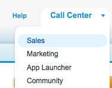
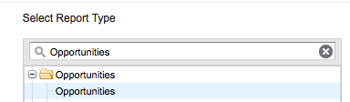
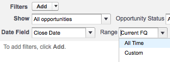
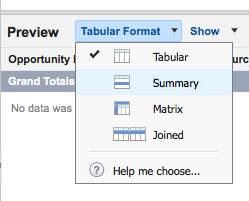
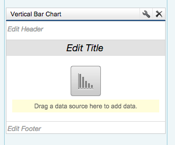
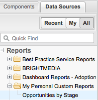
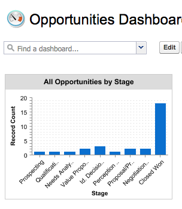

#Reports and Dashboards
Salesforce reports and dashboards allow you to create compelling dashboards to provide insights into your data and make informed decisions. In this Quickstart you will create a simple report to show all Opportunity records grouped by Stage. You will then use this report as the source of data for a dashboard that displays this information graphically.

##Step 1: Create a Report

1. In your DE environment select the **Sales** application from the application menu dropdown at the top right of the page:

    
    
2. On the resulting page, click the **Reports** tab  
3. Click the **New Report** button  
4. Type *Opportunities* into the search box and select **Opportunities** from the list of matches

    
    
5. Click the 'Create' button to create the report - this will take you to the report builder page to configure your new report

##Step 2: Configure the Report
1. In the **Filters** section click the **Range** filter for the **Close Date** field and choose **All Time** - the preview section will update with details of all opportunities

    
   
2. In the **Preview** section click the **Tabular Format** dropdown and select **Summary**

    
    
3. From the Fields list on the left hand side of the page, drag the Stage field (under the Opportunity Information folder icon) and drop this into the preview section entitled **Drag a field here to create a grouping**
5. Click the **Save** button
6. Name your report **Opportunities by Stage** and tab out of the field to automatically populate the **Report Unique Name** field. Leave all other inputs as they are
7. Click the **Save and Run Report** button - this executes the report and shows all opportunities in the org grouped by their Stage

##Step 3: Create a Dashboard
1. Click on the **Reports** tab  
2. Click the **New Dashboard** button  
3. Click and hold the vertical bar chart icon from the **Components** section on the left hand side of the page and drag into the first column

    
    
4. Click the *Edit Title* link and change the title to **All Opportunities by Stage**  
5. Click the **Data Sources** tab on the right hand side, expand the **Reports** and **My Personal Custom Reports** entries

    
    
6. Drag the **Opportunities by Stage** entry to the **Drag a data source here to add data.** section of the component  
7. Click the Save button and give your dashboard the title **Opportunities Dashboard**. Tab out of the **Title** field to automatically populate the **Dashboard Unique Name** field and click the **Save and Run Dashboard** button  
8. The dashboard will execute and display the count of Opportunity records that are in each stage as a vertical bar chart  

   